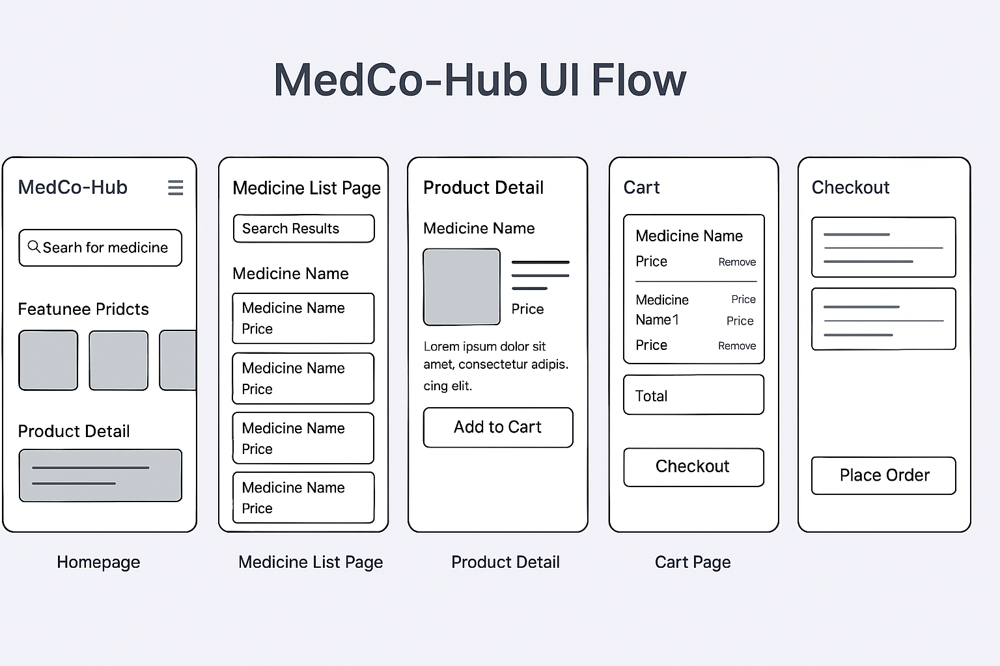

# MedCo-Hub_Project
A real-world healthcare e-commerce platform called MedCo-Hub, built with Django and React to simulate industry-grade development practices.

# MedCo-Hub 🏥💊

MedCo-Hub is a real-world healthcare e-commerce platform built using Django (Backend) and React (Frontend). It simulates how real clinics, pharmacies, and patients interact through a medical marketplace.

## 👨‍⚕️ What It Does
- Patients can search and order medicines
- Clinics can prescribe medicines and refer
- Pharmacies manage inventory and deliver orders

## 🛠️ Tech Stack
- **Frontend**: React + Tailwind CSS
- **Backend**: Django + Django REST Framework
- **Database**: PostgreSQL
- **Authentication**: JWT
- **Design**: Figma (Wireframes)
- **DevOps**: Docker (optional, coming soon)
- **Version Control**: Git + GitHub

## 📂 Project Structure (planned)
- `/frontend` → React App
- `/backend` → Django App
- `/docs` → Design files, wireframes

## 🎯 Goal
Simulate building a scalable, production-ready healthcare platform as done by real companies in industry.

## 📅 Sprint Progress
✅ Sprint 1: GitHub repo initialized, Django project created, apps structure planned

✅ Sprint 2: Models created, Admin registered, database migrations applied

✅ Sprint 3: API endpoints with DRF for CRUD, tested via browsable API, fixtures created

🚀 Sprint 4: JWT Auth + Patient Model + Retailer Signups [⏳ In Progress]

⏭️ Sprint 5: Frontend integration, User Dashboards, Search & Filters, Pagination

🎯 Sprint 6: Retailer Panel, Order system (future vision), Payments (optional SaaS plan)

## 🧩 UI Flow (Figma)

Below is the wireframe showing the main screens and navigation flow of the MedCo-Hub application.

 

---
# MedCo-Hub Backend API

This backend powers the MedCo-Hub platform for managing medical inventories.

## 🧠 Current Apps
- medicines

## 🔗 API Endpoints

Base: `/api/v1/medicines/`

| Method | Endpoint         | Description              |
|--------|------------------|--------------------------|
| GET    | /                | List all medicines       |
| POST   | /                | Add new medicine (admin) |
| GET    | /<id>/           | Retrieve one medicine    |
| PUT    | /<id>/           | Update all fields        |
| PATCH  | /<id>/           | Update some fields       |
| DELETE | /<id>/           | Delete medicine          |

## 🧪 Sample POST JSON
```json
{
  "name": "Paracetamol",
  "brand": "Generic",
  "price": 10.99,
  "stock": 100,
  "mg": 500,
  "expiry_date": "2025-12-31T00:00:00Z"
}
```

## 🧩 Fixtures
```bash
# Save current DB entries
python manage.py dumpdata medicines.Medicine --indent 2 > apps/medicines/fixtures/initial_data.json

# Load fixture data into DB
python manage.py loaddata apps/medicines/fixtures/initial_data.json
```
## 💼 For Interviewers:
This project is structured like a real-world product — complete with version control, modular code, API integration, and user-centered design.
